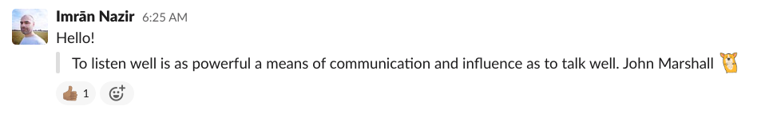

<h1 align="center">
   
  🌞Good Morning - WIP
</h1>

<h4 align="center">Automatically post inspirational quotes to 
<a href="https://slack.com">Slack</a>
</h4>

  
  

  <a href="#key-features">Key Features</a> •
  <a href="#installation">Installation</a> •
  <a href="#usage">Usage</a> •
  <a href="#contributing">Contributing</a> •
  <a href="#license">License</a>

<h1 align="center">
  
</h1>

## Key Features

Automates your morning greeting by posting one for you. Easily extendable.

## Installation

- Clone this repo.
- Make any changes you need to the [emojis](src/emojis.ts), [quotes](src/quotes.ts) or [salutations](src/salutations.ts) as required.

## Usage

## Contributing

## License

[GPL v3](https://choosealicense.com/licenses/gpl-3.0)
